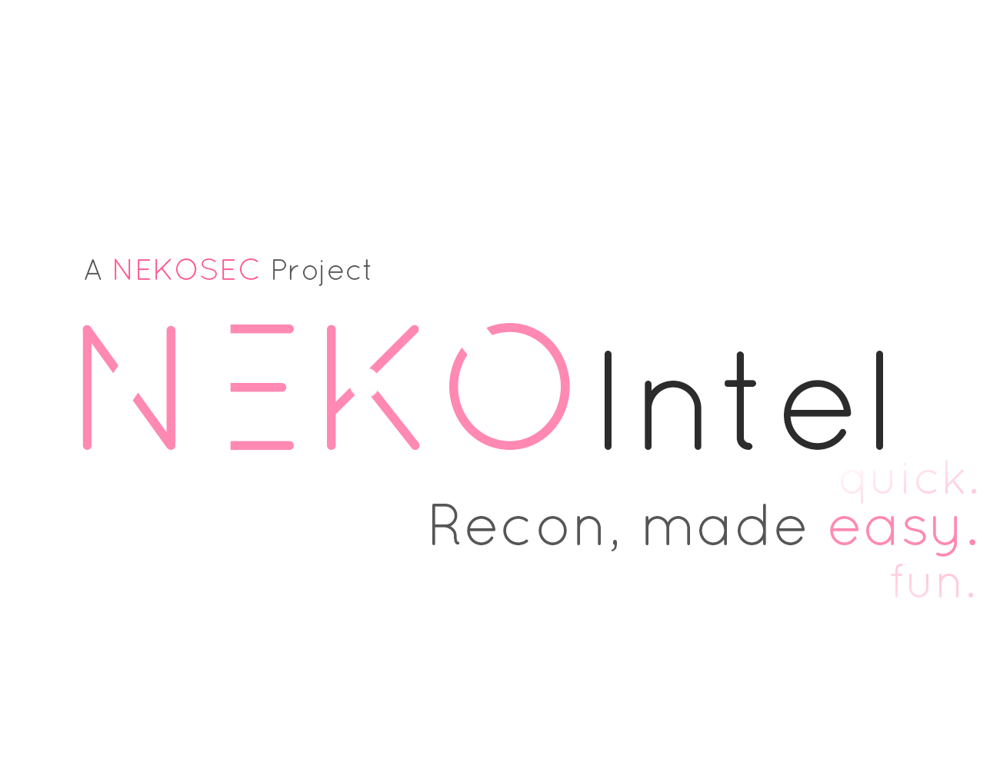

# NEKOIntel

[ English ] < -- > [ [简体中文 (Simplified Chinese)](README_cn.md) ]

*"Recon, made easy".*

NEKOIntel is a chain-like modular recon framework for security researchers, pentesters and everyone in between.

### Description

NEKOIntel is *the* tool for your assets recon-and-repeat job. With modular design and extensible in mind, it features:

- Highly modular modules.
- User-friendly interaction.
- Cross-Platform frameworks.
- Fast and reliable recon results.
- A plugin database that can be contributed by anyone.
- Seamless integration with your workflow and NEKOThreat, the successor of SWEP, our upcoming exploitation and scanner framework.

Currently under development, so here's some quick peek of in-tool command for you.

```
# The expected user experience of NEKOIntel.
[NEKOIntel] $ chain new group_subdomain purge group_host_recon purge output_json
[  OK  ]Chain 0 spawned, 5 modules armed.
[NEKOIntel] $ chain 0 info
{CHAIN0 subdomain_google/subdomain_sectrails/subdomain_recondev -> purge -> host_recon_shodan/host_recon_dummyscan -> purge -> output_json}
[NEKOIntel] $ chain 0 set target_url https://www.google.com/search/
[  OK  ]Set target_url of CHAIN0 to www.google.com.
[NekoIntel] $ chain 0 parameters
[ INFO ]{CHAIN0}
target_url: www.google.com
max_recursive_search: 3
http_request_timeout: 1
http_proxy: socks5://localhost:23333
[NEKOIntel] $ save_preset scan CHAIN0 General
[  OK  ]Saved CHAIN0 preset to presets/General.json.
[NEKOIntel] $ load_preset scan General
[ INFO ]The cat is loading presets...
[ INFO ]Loaded preset General to CHAIN1.
[NEKOIntel] $ chain 1 info
[ INFO ]{CHAIN1 subdomain_google/subdomain_sectrails/subdomain_recondev -> purge -> host_recon_shodan/host_recon_dummyscan -> purge -> output_json}
[NEKOIntel] $ chain 1 fire
[ INFO ]The cat is pressing the big red button...
...
```

And some peek else for curious users that wonders how does the output looks like...

```
[NEKOIntel] CHAIN0 $ fire
[ INFO ] The cat is pressing the big red button...
[ INFO ] Starting check on 1 domain(s).
[ INFO ] Firing CHAIN0 { subdomain_google/subdomain/sectrails/subdomain_recondev -> purge -> host_recon_shodan/host_recon_nmap/host_recon_dummyscan -> purge -> domain_fidelity_check/domain_tagger -> purge -> output_text }.
...
[ INFO ] The cat is finalizing the results.
sup0rsonic.github.io ( 185.199.110.153, 0 history(ies) found. )
|   Tags: Github, Github Pages, Github pages blog, Hexo, Nodejs, Ruby
|   Fidelity(f): Github Pages(100%), Blog(75%), Hexo(100%)	
|	Whois: MarkMonitor Inc., CA, US.
Root domain: github.io ( 53 Subdomains found )
0 Subdomain(s) found.
1 IP Address(es) found.
IP Address: 185.199.110.153
|   Status: [ UP, MAIN_ADDR ]
|   Tags: Github, WebHosting
|   Fidelity(f): Github(100%), WebHosting(100%), Reverse Proxy(30%), HTTPS(100%)
|   2 Open port(s) found.
|   |   [ OPEN ] 80 HTTP, http-proxy, Varnish
|   |   [ OPEN ] 443 HTTPS ssl/https GitHub.com
|
[  OK  ] Chain complete.
[ NEKOIntel ] CHAIN0 $
```

